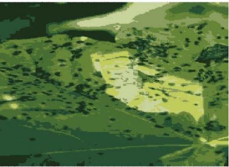

## The Test Image

    Fig 1: The image inputted by the user on a GUI(bottom left corner)

## Training Set containing information about pomegranate leaves on MySQL database

    Fig 2: Extract of Alternaria Alternata Dataset

    Fig 3: Extract of Anthracnose Dataset

    Fig 4: Extract of Bacterial Blight Dataset

    Fig 5: Extract of Cercospora Dataset

    Fig 6: Extract of Healthy Leaves Dataset
    
 
## Resultant test image after image segmentation

    Fig 7: Test Image after applying cleaning and segmentation methods

## Results obtained after applying K-Means Clustering

    Fig 8: Image obtained when K_cluster value is 5

    Fig 9: Image obtained when K_cluster value is 7

    Fig 10: Image obtained when K_cluster value is 11

## Predicted Disease 

    Fig 11: Table generated predicts the disease and disease causing agent 

## Accuracy of the model with different cluster values

    Fig 11: Accuracy prediction. K_cluster value = 11 gives the most accurate results
